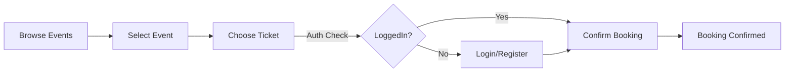

<div align="center">
  
  <h2>Client Application</h2>
  <p><strong>Modern Event Discovery Experience</strong></p>
  <p>The frontend for <strong>Event Horizon</strong>, built with <strong>React 19</strong>, <strong>Vite</strong>, and <strong>Tailwind CSS 4</strong>. It delivers a fast, responsive, and immersive experience for discovering and booking events.</p>
</div>

<div align="center">
    
  [](https://react.dev/)
  [](https://vitejs.dev/)
  [](https://tailwindcss.com/)
  [](https://vercel.com/)
</div>

<br />

## ✨ Features

- **🎨 Modern Design System**: Built with Tailwind v4 for rapid, utility-first styling.
- **📱 Responsive Layouts**: Mobile-first design ensuring great experience on all devices.
- **⚡ High Performance**: Powered by Vite 7 for instant server starts and HMR.
- **🔄 User Flows**:
  - **Browse**: Filterable event lists.
  - **Detailed View**: Rich event pages with image support.
  - **Booking**: Seamless checkout process.

## 🛠️ Tech Stack

<div align="center">

|                                               Framework                                                |                                              Tooling                                               |                                                      Styling                                                      |                                               Deployment                                               |
| :----------------------------------------------------------------------------------------------------: | :------------------------------------------------------------------------------------------------: | :---------------------------------------------------------------------------------------------------------------: | :----------------------------------------------------------------------------------------------------: |
| <br/>**React 19** | <br/>**Vite 7** | <br/>**Tailwind 4** | <br/>**Vercel** |

</div>

## 🛍️ User Booking Flow



## 📁 Project Structure

<details>
<summary>Click to view folder structure</summary>

```
Frontend/src/
├── 📁 components/       # Reusable UI components
│   ├── 📄 EventCard.tsx
│   ├── 📄 Navbar.tsx
│   └── 📄 Footer.tsx
├── 📁 Page/             # Application Pages
│   └── 📄 ...
├── 📁 api/              # API Integration
├── 📁 assets/           # Static assets
└── 📄 App.tsx           # Main App Component
```

</details>

## 🚀 Getting Started

### Prerequisites

- **Node.js 18+**
- **pnpm** (recommended) or npm/yarn

### 1. Clone & Install

```bash
git clone https://github.com/yourusername/event-horizon-frontend.git
cd Frontend
pnpm install
```

### 2. Environment Configuration

Create a `.env` file in the root directory:

```env
VITE_IMGBB_API_KEY=your_imgbb_api_key
VITE_BACKEND_API_URL=http://localhost:3000
```

> **Note**: `VITE_BACKEND_API_URL` should point to your local backend or hosted Heroku URL.

### 3. Run Locally

```bash
pnpm dev
```

The app will be available at `http://localhost:5173`.

## 🌐 Deployment (Vercel)

This project is configured for seamless deployment on Vercel.

1.  **Import Project**: Connect your GitHub repository to Vercel.
2.  **Environment Variables**: Add `VITE_BACKEND_API_URL` and `VITE_IMGBB_API_KEY` in the Vercel dashboard.
3.  **Deploy**: Vercel will automatically build and deploy your React app.
